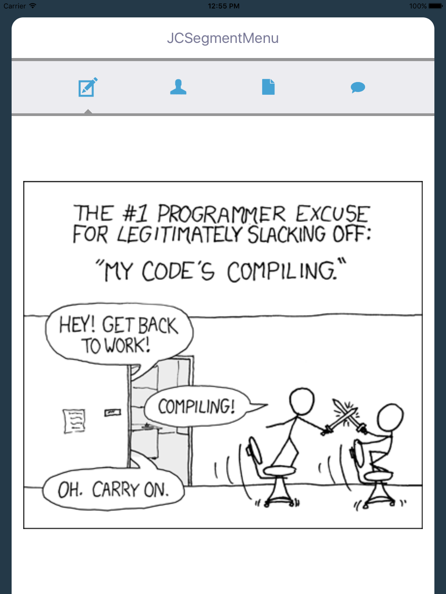
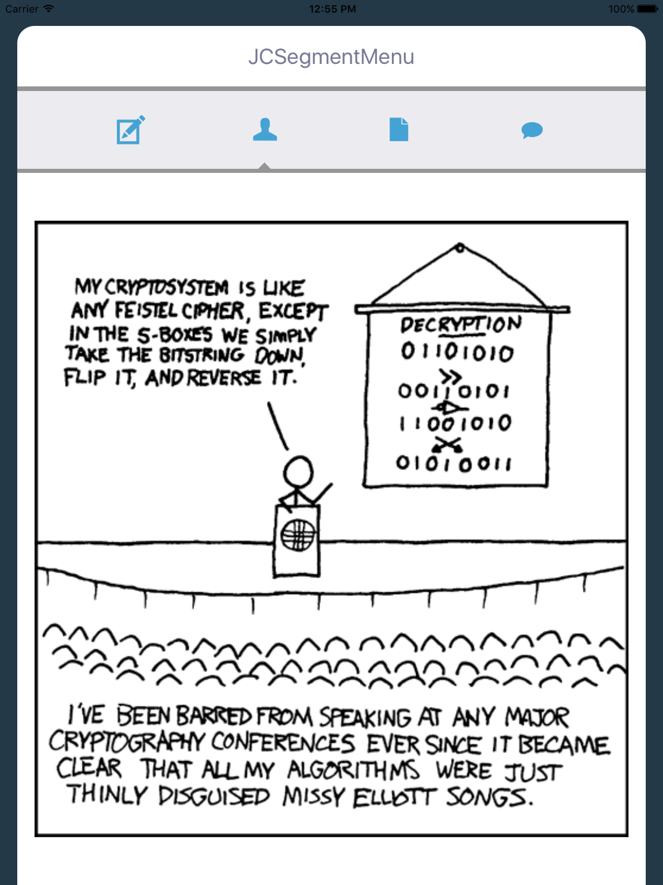
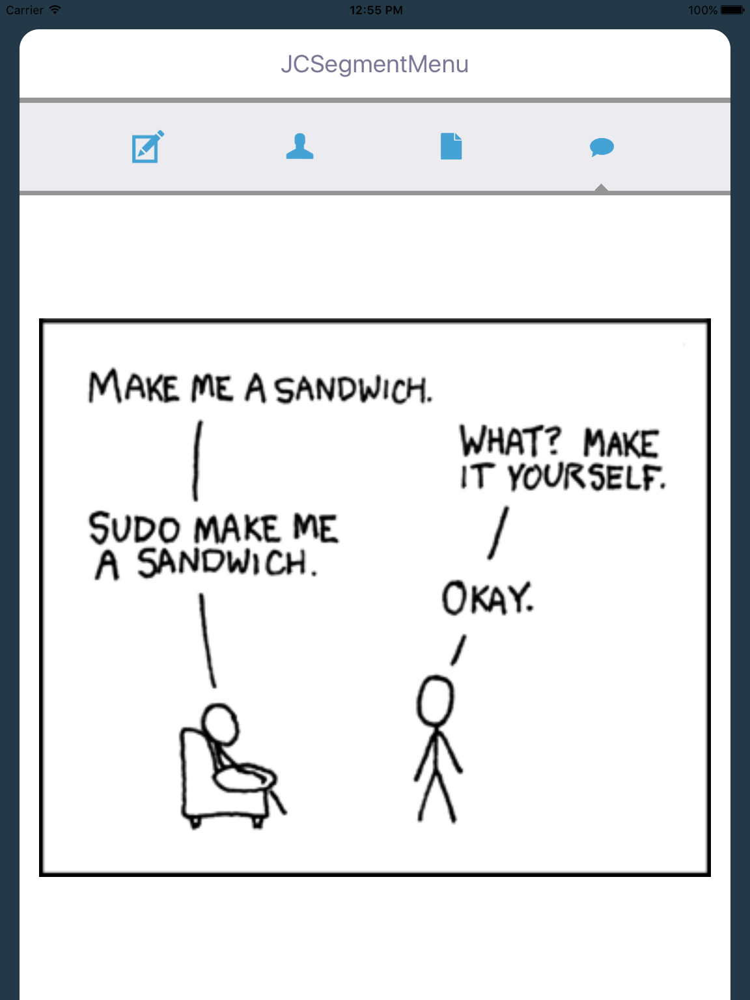

JCSegmentMenu
---------------

By Jordan Coff

Purpose
--------------

JCSegmentMenu is a light-weight front end for a tab control. Use it, love it, fork it, do stuff.









Usage
-----------------------------

1. Drag a UIView onto your storyboard
2. Do autolayout stuff
3. Set the class to JCSegmentMenu
4. Set the delegate
5. Create a referencing outlet
6. Initialize the menu

```objc
[_segmentMenu setDelegate:self];
UIButton* b1 = [_segmentMenu defaultSegmentButtonWithOptions:@{@"type":@"image", @"imageName":image1}];
UIButton* b2 = [_segmentMenu defaultSegmentButtonWithOptions:@{@"type":@"image", @"imageName":image2}];
UIButton* b3 = [_segmentMenu defaultSegmentButtonWithOptions:@{@"type":@"image", @"imageName":image3}];
UIButton* b4 = [_segmentMenu defaultSegmentButtonWithOptions:@{@"type":@"image", @"imageName":image4}];
[_segmentMenu setSegmentButtons:@[b1, b2, b3, b4]];
```

The menu alerts the delegate when a segment is pressed. 

```objc
@protocol JCSegmentMenuDelegate <NSObject>
@optional

-(void)button:(UIButton*)sender pressedAtIndex:(NSInteger) index;

@end
```

Author
-----------------

[Jordan Coff](https://www.github.com/jcoff28 "Jordan Coff Github") 

Please create a Github issue if you have any questions, suggestions, or comments.
